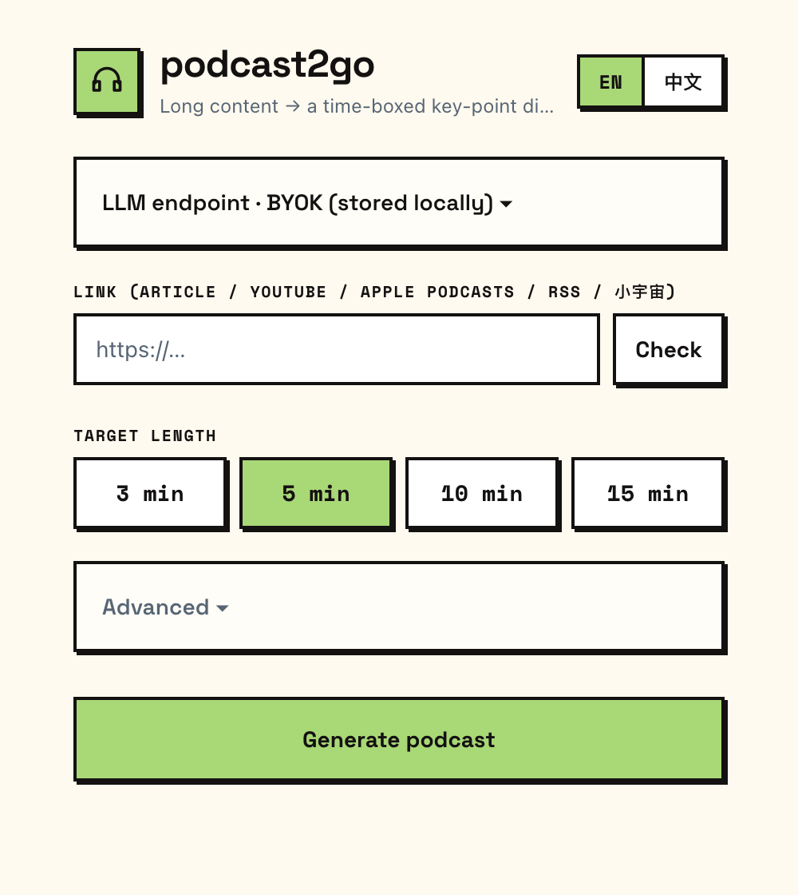
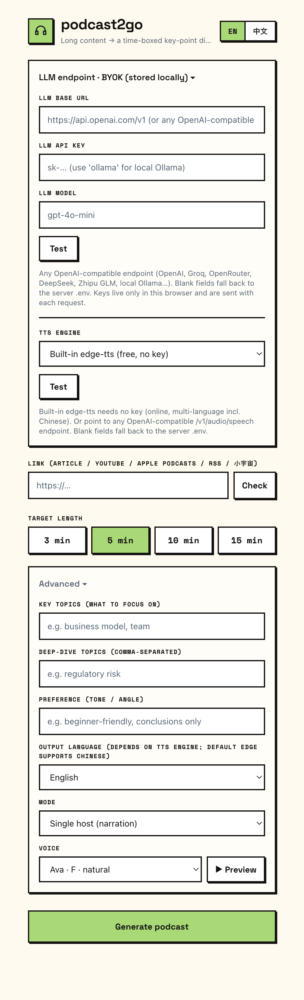

# podcast2go


[](README.md)
[](README.zh-CN.md)
[](https://www.python.org/)
[](https://fastapi.tiangolo.com/)


An hour-long podcast doesn't fit into the walk to the station, and neither does a
four-thousand-word article. podcast2go takes the link, asks how many minutes you have, and
hands back an audio digest that runs about that long: the key points only, with background
pulled in from a web search. Earbuds in, and you're done with it by the time you arrive.

It's a self-hosted FastAPI app with a mobile web UI. Every engine it ships with is free,
open source, and needs no API key. The one thing you supply is an LLM endpoint, and that
can be Ollama on your own laptop.

## How it works

```
link -> ingest -> extract key points -> web research -> time-boxed script -> TTS -> audio
```

1. **Ingest** reads the source: articles via trafilatura, YouTube via captions, Apple Podcasts / RSS / 小宇宙 by resolving the episode audio, plain audio URLs via Whisper STT.
2. **Extract** has an LLM boil the long text down to ranked key points.
3. **Research** searches the web on the top-ranked points and collects background and sources.
4. **Script** writes a spoken script against a word budget (`target minutes × words per minute`), in a real human speaking voice, as a monologue or a two-host conversation.
5. **Synthesize** renders it to mp3 and hands it to the player.

## What it does

- Length control is deterministic. Pick 3, 5, 10 or 15 minutes and the script step writes to a budget worked out in code (`minutes × 150` words, or `minutes × 240` characters for Chinese and Japanese, which is roughly how fast those are spoken) instead of letting the model stop wherever it likes. A single-host clip measures within about 10% of what you asked for. Two-host dialogues come in short, often 20 to 40% under, because the model writes brief turns and wraps up once the conversation sounds finished. Pick single-host when the length has to be right.
- Two formats: a single host talking, or two hosts going back and forth with a separate voice each.
- A voice picker with a Preview button, curated per output language. Or point it at your own OpenAI-compatible TTS endpoint.
- Sources: articles, YouTube, Apple Podcasts, RSS feeds, 小宇宙, and direct audio files. A Check button tells you whether a link resolves before you spend a whole generation on it.
- Steering: focus topics, topics to go deeper on, tone and angle, output language.
- Scripts are written against a set of anti-AI-writing rules (English and 中文) so the host doesn't sound like a chatbot reading its own bullet points.
- Multi-language audio through edge-tts, Chinese included.
- Test buttons for the LLM and TTS endpoints, so a bad key fails in one second rather than four minutes in.
- Installs to a phone home screen and keeps playing with the screen locked (Media Session API).
- Bilingual UI, English and 简体中文.
- BYOK: the LLM and TTS endpoint, key and model can come from the settings panel in the browser instead of `.env`.

## Screenshots

<table>
  <tr>
    <td align="center"><b>Home</b></td>
    <td align="center"><b>Advanced &amp; settings</b></td>
  </tr>
  <tr>
    <td valign="top"></td>
    <td valign="top"></td>
  </tr>
</table>

## Engines

Everything the project ships with is free, open source and keyless. Swapping one out means
adding a branch in the matching `providers/*.py` and returning the same shape.

| Capability | What ships | What you can plug in instead |
|---|---|---|
| **LLM** | any OpenAI-compatible endpoint | OpenAI, Groq, OpenRouter, DeepSeek, Zhipu GLM, Qwen, Moonshot (Kimi), local **Ollama** |
| **TTS** | edge-tts (multi-language, Chinese included) | OpenAI TTS, ElevenLabs, Piper (offline), [CosyVoice](https://github.com/FunAudioLLM/CosyVoice) (Alibaba, open source), [VoxCPM](https://github.com/OpenBMB/VoxCPM) (local, voice cloning) |
| **Web search** | DuckDuckGo (`ddgs`) | Tavily, Brave, Serper, an agent's native web search |
| **Article extract** | trafilatura | Tavily Extract, Mercury, Readability |
| **STT** (audio sources) | faster-whisper | |

### Voices

The bundled voice engine is [edge-tts](https://github.com/rany2/edge-tts), the neural voices
behind Microsoft Edge. Free, no key, mp3 out (`backend/providers/tts.py`).

Advanced options let you pick the narrator voice from a curated list, hit Preview to hear a
sample, and switch between one host and a two-host conversation where each speaker gets its
own voice. If you leave the voice blank it's chosen from the output language: English,
Chinese, Japanese, French, German, Spanish and Portuguese each map to a default neural voice
(`en-US-AriaNeural`, `zh-CN-XiaoxiaoNeural`, and so on), anything else falls back to English.
Pin one with `EDGE_VOICE=` in `backend/.env`, or per session from the UI.

edge-tts streams from Microsoft's servers, so synthesis needs a connection. It is not a local
voice. For offline audio, swap in Piper (light, runs on CPU) or
[VoxCPM](https://github.com/OpenBMB/VoxCPM) from OpenBMB (Apache-2.0, open weights, zero-shot
voice cloning in Chinese and English), which runs offline but wants an NVIDIA GPU.

The length of the clip comes from the script, not from the voice. The script step writes to
`minutes × WPM` words (`WPM=150` by default), or `minutes × 240` characters when the output
language is Chinese or Japanese. The finished mp3 is then measured with `mutagen` and the real
duration shows in the player, so you see what you actually got rather than what was asked for.

## Quickstart

Needs Python 3.10 or newer.

```bash
git clone https://github.com/weijt606/podcast2go.git
cd podcast2go

cp .env.example backend/.env          # optional, you can also set the LLM in the app

cd backend
python3 -m venv .venv && source .venv/bin/activate
pip install -r requirements.txt
uvicorn main:app --reload --port 8000
# open http://localhost:8000
```

### Point it at an LLM

This is the only credential the app needs. Edit `backend/.env` and aim it at any
OpenAI-compatible endpoint:

```bash
# Hosted, pick one
LLM_BASE_URL=https://api.deepseek.com/v1          LLM_API_KEY=sk-...  LLM_MODEL=deepseek-chat
LLM_BASE_URL=https://open.bigmodel.cn/api/paas/v4 LLM_API_KEY=...     LLM_MODEL=glm-4-flash
LLM_BASE_URL=https://api.openai.com/v1            LLM_API_KEY=sk-...  LLM_MODEL=gpt-4o-mini
LLM_BASE_URL=https://api.groq.com/openai/v1       LLM_API_KEY=gsk_... LLM_MODEL=llama-3.3-70b-versatile

# Fully local, no key. Install Ollama, run `ollama pull llama3.1`, then:
LLM_BASE_URL=http://localhost:11434/v1            LLM_API_KEY=ollama  LLM_MODEL=llama3.1
```

The `.env` file is optional. All it holds is server-side defaults. If you fill in the Base URL,
key and model in the app's settings panel, they ride along with each request and take
precedence, so you can run with no `.env` at all; blank fields there fall back to `.env`. Use
the file when you want a default that survives switching browsers, use the panel when you're
on a phone.

To ingest Apple Podcasts, RSS, 小宇宙 or audio URLs, which all go through Whisper STT, also run
`pip install faster-whisper`. Spotify isn't supported, because it exposes no open episode audio.

## First run

Shortest path from nothing to a finished digest, no paid API involved.

Point it at an LLM first, either through `backend/.env` or the app's settings panel, as above.
If you'd rather not pay anyone, install [Ollama](https://ollama.com) and `ollama pull llama3.1`.

Then follow [Quickstart](#quickstart): clone, `.env`, `pip install`, `uvicorn`. When the
terminal prints `Uvicorn running on http://127.0.0.1:8000`, open that address.

Now make one:

1. Paste a link. Article, YouTube, Apple Podcasts, an RSS feed, or 小宇宙. Tap Check to confirm it resolves.
2. Pick a target length: 3, 5, 10 or 15 minutes.
3. Optionally open Advanced for focus and deep-dive topics, tone, output language, one host or two, and the voice with its Preview button.
4. Hit Generate podcast and watch the five steps go by: parse, extract, research, script, voice.
5. When the player shows up, press play. You can jump by chapter, skim the key points and sources, read the full script, or download the mp3. Lock the phone and it keeps going.

No key in `.env`? Tap the settings panel at the top and paste an LLM Base URL, key and model
there instead. They stay in that browser, which is the convenient thing on a phone.

For podcast and audio links, run `pip install faster-whisper` once before you start.

## Notes

Generated audio defaults to English; switch the output language in the UI. edge-tts covers
Chinese, Japanese and several European languages.

Chapter timestamps are measured from the audio of each section rather than guessed. When the
script doesn't split cleanly the app falls back to an even split and marks those timestamps
with a leading `~`, so you can tell the difference.

Job state lives in memory in a single process, and a finished job's mp3 is deleted six hours
later. This is a personal tool you host yourself, not a multi-tenant service.

Architecture and build details are in [CLAUDE.md](./CLAUDE.md).
