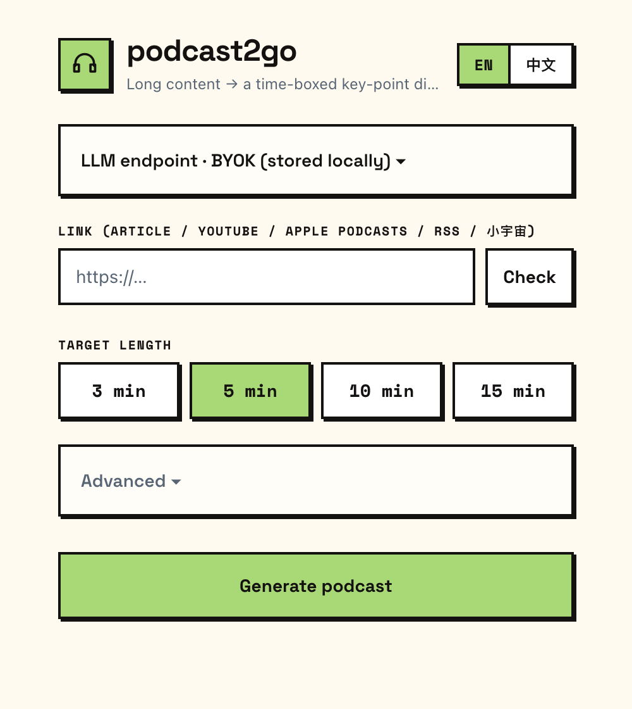
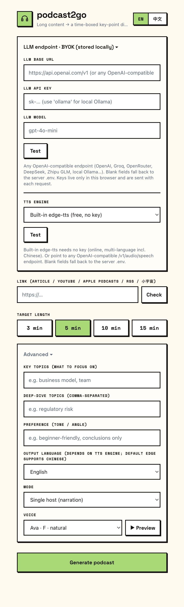

# 🎧 podcast2go


[](README.zh-CN.md)
[](README.md)
[](https://www.python.org/)
[](https://fastapi.tiangolo.com/)


> 把一个很长的播客 / 视频 / 文章，压成一段**时长可控、重点突出、并经过网络检索补充**的语音播客 —— 专为通勤、跑步、散步、开车时**后台收听**而设计。

## 这是什么

长内容（一小时的播客、几千字的文章）很难在碎片时间消化。用 podcast2go，你贴一个链接、选一个目标时长，就得到一段**刚好那么长**、只讲重点、还顺手从网络补充了背景的语音播客，戴上耳机就能听完。

它是一个小巧的自托管 FastAPI 应用，带移动端网页界面，**不绑定任何厂商**，**开箱即用免费/开源引擎**——你唯一需要自备的是一个 LLM 端点（也可以是本地的）。

### 工作流程

```
链接 ─▶ 解析 ─▶ 提取重点 ─▶ 网络检索 ─▶ 定长脚本 ─▶ 语音合成 ─▶ 🎧
```

1. **解析来源** — 文章（trafilatura）、YouTube（字幕）、**Apple Podcasts / RSS / 小宇宙**、或音频直链（Whisper STT）
2. **提取重点** — LLM 把长文本提炼成排序后的核心点
3. **网络检索** — 对最重要的点做网络搜索，补上背景与出处
4. **撰写脚本** — 按 `目标分钟 × 语速` 的字数预算生成定长口语脚本，用真人口吻撰写（anti-vibe-writing 规则），可选单人独白或双人对谈
5. **语音合成** — TTS 合成音频，前端支持锁屏后台播放

### 特性

- ⏱️ **时长可控**（3 / 5 / 10 / 15 分钟），基于确定性的字数预算
- 🎙️ **两种形态**：单人讲解 或 **双人对谈**（两位说话人各用一个音色）
- 🗣️ **音色选择 + 试听** — 按语言提供 curated 自然音色，或接自定义 TTS API
- 🧑 **真人化文稿** — anti-vibe-writing 规则去掉 AI 写作味（中英）
- 📻 **播客 / 音频解析** — Apple Podcasts、RSS 订阅源、小宇宙、YouTube、文章、音频文件（带一键**链接检测**）
- 🎛️ **可引导**：核心点、深度了解的点、语气/视角、输出语言
- 🌍 **多语言**音频（含中文），由 edge-tts 提供
- 🔌 **连通性测试**按钮（LLM 与 TTS 端点）
- 📱 移动端 PWA，**后台播放**（Media Session API）
- 🌐 **中英双语界面**一键切换
- 🔑 **BYOK** — 在界面或 `.env` 里自带 LLM / TTS 端点与 key

## 截图

<p>
  
  
</p>

首页（贴链接、选时长）· 高级与设置（LLM/TTS 测试按钮、TTS 引擎选择、单人/对谈模式、音色选择 + **▶ 试听**）。

## 引擎（均可替换）

本项目默认所用的引擎全部免费/开源、**无需 key**。架构可插拔——想用付费 API，只需在对应 `providers/*.py` 加分支。

| 能力 | 本项目使用的方案 | 可自行接入的推荐项 |
|---|---|---|
| **LLM** | 任意 OpenAI 兼容端点 | OpenAI · Groq · OpenRouter · DeepSeek · 智谱 GLM · 通义千问 Qwen · 月之暗面 Kimi · 本地 **Ollama** |
| **TTS** | edge-tts（多语言含中文） | OpenAI TTS · ElevenLabs · Piper（离线） · [CosyVoice](https://github.com/FunAudioLLM/CosyVoice)（阿里, 开源） · [VoxCPM](https://github.com/OpenBMB/VoxCPM)（本地, 可克隆音色） |
| **网络搜索** | DuckDuckGo（`ddgs`） | Tavily · Brave · Serper · LLM/agent 原生联网搜索 |
| **正文抽取** | trafilatura | Tavily Extract · Mercury · Readability |
| **STT**（音频源） | faster-whisper | — |

### 语音合成（TTS）

本项目使用的语音引擎是 [**edge-tts**](https://github.com/rany2/edge-tts) —— 微软 Edge 的在线神经语音。
**免费、无需 key**，输出 **mp3**（`backend/providers/tts.py`）。

- **选音色、试听、挑形态。** 高级选项里可从 curated 自然音色列表选配音音色、按 **▶ 试听** 听样本，
  并在**单人讲解**与**双人对谈**（两位说话人各用一个音色）间切换。LLM 端点与自定义 TTS API 都可在设置
  面板里**测试连通**。
- **音色按输出语言自动选择。** 英语、中文、日语、法语、德语、西班牙语、葡萄牙语各对应一个默认神经
  音色（如 `en-US-AriaNeural`、`zh-CN-XiaoxiaoNeural`），其余回退英语。想锁定特定音色，在
  `backend/.env` 里设 `EDGE_VOICE=`（也可在界面按会话设置）。
- **在线，非离线。** edge-tts 从微软服务流式取音，所以合成**需要联网**——它不是本地/离线音色。要本地/
  离线出音，换 **Piper**（轻量、跑 CPU）或 **[VoxCPM](https://github.com/OpenBMB/VoxCPM)**（OpenBMB，
  Apache-2.0，开放权重）——一个紧凑的本地模型，录音棚级音质、可零样本克隆音色（中文、英文等）；可离线
  运行，但需要 NVIDIA GPU。
- **时长由脚本决定，不是靠语音。** 音频之所以约等于`目标分钟`，是因为脚本步骤按确定性字数预算写稿
  （`分钟 × WPM`，默认 `WPM=150`）。成品 mp3 的真实时长再用 `mutagen` 量出来并显示在播放器。
- **更换引擎**：在 `backend/providers/tts.py` 加一个分支、返回同样的 `{audio, ext, duration}`
  结构即可 —— OpenAI TTS · ElevenLabs · Piper（离线） ·
  [CosyVoice](https://github.com/FunAudioLLM/CosyVoice)（阿里, 开源） ·
  [VoxCPM](https://github.com/OpenBMB/VoxCPM)（`pip install voxcpm`，本地 GPU）。

## 快速开始

需要 **Python ≥ 3.10**。

```bash
git clone https://github.com/weijt606/podcast2go.git
cd podcast2go

cp .env.example backend/.env          # 可选——也可在界面 BYOK 面板里配置 LLM

cd backend
python3 -m venv .venv && source .venv/bin/activate
pip install -r requirements.txt
uvicorn main:app --reload --port 8000
# 打开 http://localhost:8000
```

### 配置 LLM（唯一必填）

编辑 `backend/.env`，指向任意 OpenAI 兼容端点，例如：

```bash
# 云端（任选其一）——国产优先
LLM_BASE_URL=https://api.deepseek.com/v1          LLM_API_KEY=sk-...  LLM_MODEL=deepseek-chat
LLM_BASE_URL=https://open.bigmodel.cn/api/paas/v4 LLM_API_KEY=...     LLM_MODEL=glm-4-flash
LLM_BASE_URL=https://api.openai.com/v1            LLM_API_KEY=sk-...  LLM_MODEL=gpt-4o-mini
LLM_BASE_URL=https://api.groq.com/openai/v1       LLM_API_KEY=gsk_... LLM_MODEL=llama-3.3-70b-versatile

# 完全本地（无 key）——装好 Ollama，`ollama pull llama3.1`，然后：
LLM_BASE_URL=http://localhost:11434/v1            LLM_API_KEY=ollama  LLM_MODEL=llama3.1
```

也可在界面顶部的设置面板里按会话设置 LLM 端点（存于浏览器本地）。

**还需要 `.env` 文件吗？** 不需要，它是可选的。`.env` 只是*服务端默认值*。如果你在界面 BYOK 面板里填了
Base URL / key / model，它们会随每次请求发送并优先生效，所以**完全不建 `.env` 也能跑**。界面留空的字段
才回退到 `.env`。想要一个持久默认值、不必每个浏览器重填时，再用 `.env`。

要解析 Apple Podcasts / RSS / 小宇宙 / 音频直链（用 Whisper STT 转写），再 `pip install faster-whisper`。
（不支持 Spotify——它不开放单集音频。）

## 新手指引

第一次用？这是从零到一段成品播客的最短路径——**不需要任何付费 API**。

**1 · 指向一个 LLM。** podcast2go 只需要一个 LLM 端点——任意 OpenAI 兼容 API 都行（OpenAI、Groq、
OpenRouter、DeepSeek、智谱 GLM…）。把 Base URL / key / model 填进 `backend/.env`，或直接填到界面 BYOK 设置
面板——见 [配置 LLM](#配置-llm唯一必填)。

*可选的免 key 方案：* 用 [Ollama](https://ollama.com) 在本机跑一个模型：

```bash
# 从 ollama.com 装好 Ollama，然后：
ollama pull llama3.1
```

**2 · 安装并启动。** 按上面的 [快速开始](#快速开始)（克隆 → `.env` → `pip install` →
`uvicorn`）。当终端打印 `Uvicorn running on http://127.0.0.1:8000`，在浏览器打开这个地址。

**3 · 生成你的第一段播客。**

1. 贴一个**链接**——文章 URL 或 YouTube 链接。
2. 选一个**目标时长**（3 / 5 / 10 / 15 分钟）。
3. *（可选）* 展开**高级选项**，设置核心点、语气/视角、输出语言。
4. 点**生成播客**，看五个步骤依次跑完（解析 → 提取 → 检索 → 脚本 → 合成）。
5. 播放器出现后按播放——或锁屏继续听（后台播放）。

**4 · 没在 `.env` 填 key？用界面面板。** 点顶部的设置面板，把 LLM Base URL / key / model 贴进去
（仅存于当前浏览器，手机上很方便）。留空则回退到 `backend/.env`。

> 想压缩音频/播客直链（不只是文章/YouTube）？先 `pip install faster-whisper` 一次。

## 说明

- 生成音频默认英文；可在界面切换输出语言（edge-tts 支持中文、日文及多种欧洲语言）。
- 任务状态在内存、单进程——这是个人/自托管工具，非多租户服务。

架构与构建细节见 [CLAUDE.md](./CLAUDE.md)。
